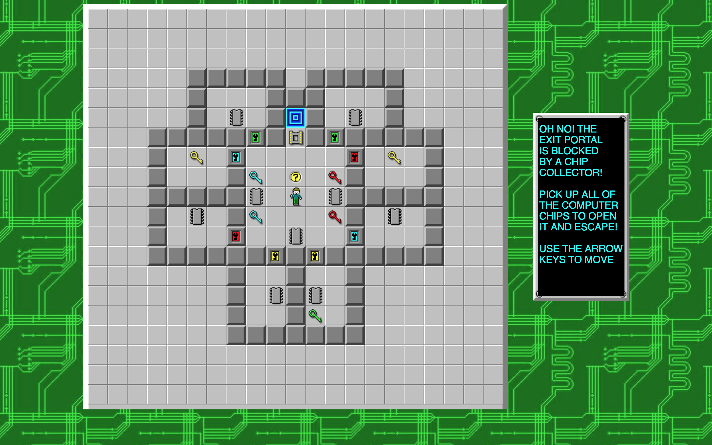
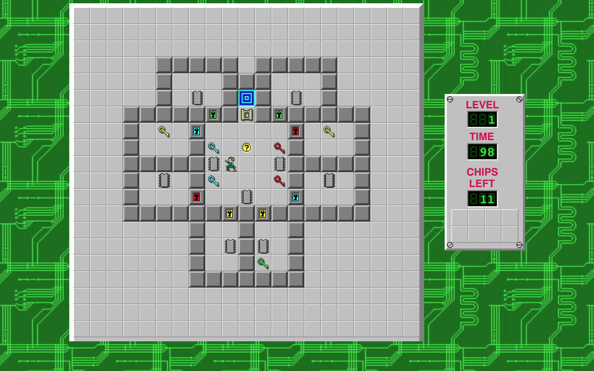
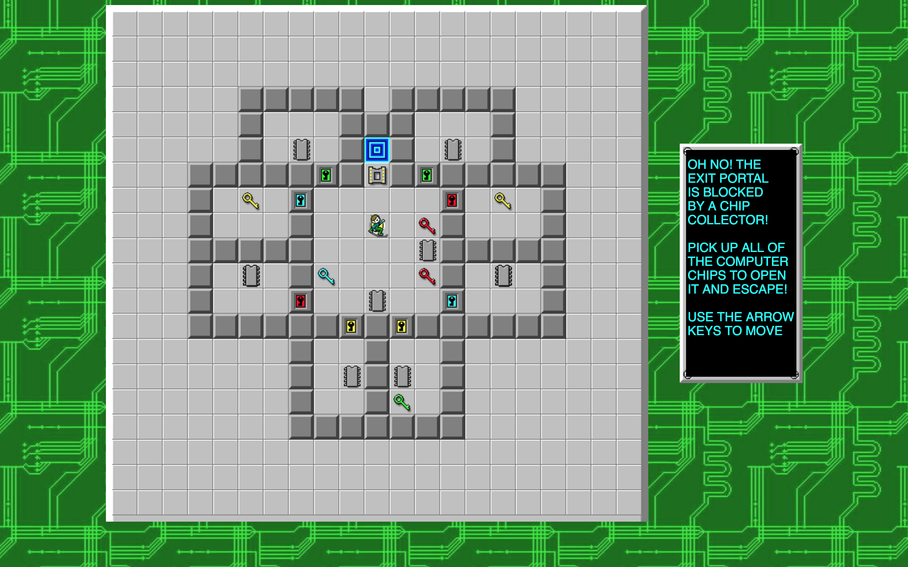
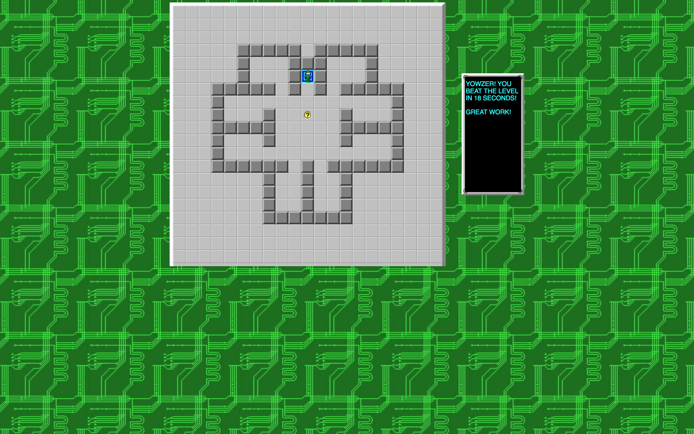
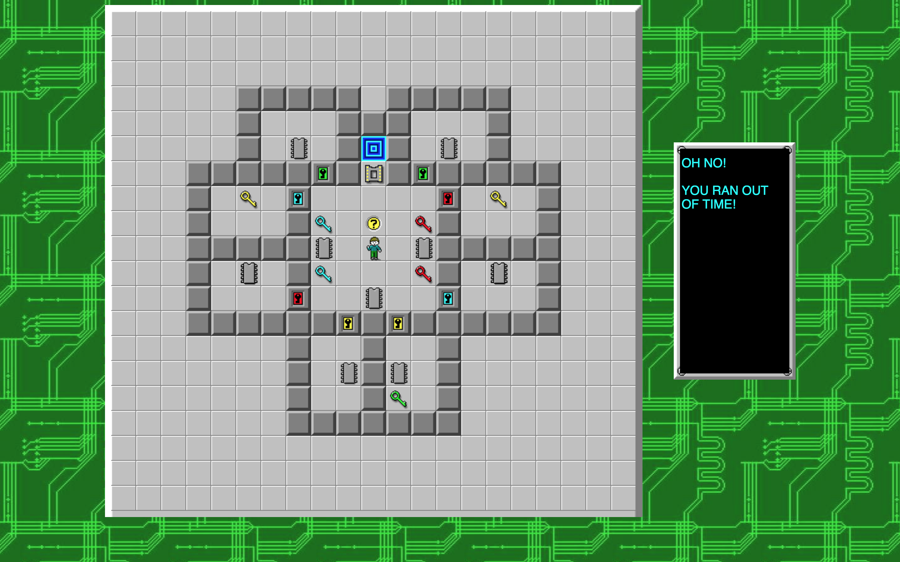

## [Chips Challenge][live]

A clone of the first level of the 1992 computer game [Chips Challenge][wikipedia], created by Chuck Sommerville.

[live]: https://erhsparks.github.io/ChipsChallenge

### Background

In this classic PC adventure puzzle game, our hero Chip is a high school computer geek on a journey to win the approval of Melinda the Mental Marvel by successfully navigating her deadly Clubhouse -- collecting computer chips and avoiding peril along the way -- in order to gain entry into her Bit Busters club. Chip must use his every mental resource to dodge deadly monsters and navigate brain-bending puzzles on each level to find all of the computer chips hidden around the map in a race against the countdown clock!

The original Chips Challenge is a 1-player game which uses the arrow keys to move Chip in the four cardinal directions. Chip's field of view is limited to a 9 x 9 grid in which he remains centered: as the player gives him commands to move, the map shifts around him. As he explores, he must run a gantlet of obstacles, so that he can collect the computer chips required to pass through the portal to the next level.

Chip's various challenges include locked doors to which he must find keys, surfaces which are impassable or which move him in undesirable ways unless some item is found, bombs, monsters, spies who take Chip's items, the time clock, and the levels themselves, which are often maze-like logic puzzles.

See [this playthrough][playthrough] to get a feel for gameplay.

[wikipedia]: https://en.wikipedia.org/wiki/Chip%27s_Challenge
[playthrough]: https://www.youtube.com/watch?v=pcdMh1M7QLI

### The Game

This single-page app is a clone of the first level of the MS version of Chips Challenge.

Users are greeted by a welcome screen with a view of the game and an info box in the style of the original, explaining the goals and movements:



The player moves Chip using the arrow keys, and has him pick up items by walking into the square that item is on. As soon as Chip makes his first move, the welcome message disappears and the level info is revealed.



Chip is unable to walk through walls, and may only pass remove locked doors and the chip collector socket if he has a key of the appropriate color or all the chips required for that level, respectively. All keys except the green key, which may be used indefinitely, are removed from Chip's inventory after opening a door of the same color.


The user may revisit the instructions at any time by moving Chip back onto the hint square. The timer is paused while Chip is standing here.



When Chip has collected all required chips, the 'CHIPS REMAINING' panel turns gold, and Chip is able to pass through the chip socket gate to reach the exit portal.


When Chip enters the portal in the original game, a popup appears telling him his time, whether is was a personal best, and whether he won on the first try. The submit button reads 'Onwards!' and takes the user to the next level.

This clone only has one level so far, and I thought a pop up would be way too annoying, so when Chip wins or loses, the info text appears again on top of the info panel, with a win or lose message.



This game has no database and does not store session state, so no best time info is displayed. In future, I plan to implement a restart button, which will reset the game but will not reset the page, so I could easily add a best time function to the main game class. This would only persist until the page was refreshed, of course, but it would still be fun!



All of the tiles used were taken from the [Chips Challenge Wiki][chips_wiki], and I greatly appreciate their hard work and their making the game graphics available for public use. The backgrounds and info panels came from screenshots, lightly edited with Gimp.

[chips_wiki]: http://chipschallenge.wikia.com/wiki/Chip%27s_Challenge_Wiki

### Implementation

Chips is written in JavaScript, using the D3 library for object rendering and manipulation, and one jQuery call for DOM content loaded.


jQuery example:
```JavaScript
// from assets/javascripts/main.js : the webpack entry file; starts the
// page's scripts.

// using npm for all library packages. See also i.e. chips_game.js call
// "import * as d3 from 'd3';"
import $ from 'jQuery';
import ChipsChallenge from './chips_game';

// asynch DOMContentLoaded function. The game will not run until the
// HTML document has loaded.
$(() => {
  new ChipsChallenge();
});
```

d3 and JavaScript example:
```JavaScript
// from assets/javascripts/map.js : creating the first level
addItems () {
  // item starting postions are kept in an object which relates item
  // type to arrays of those items' starting positions
  let mapItems = this.itemStartingPositions();
  let items = Object.keys(mapItems);

  // making each type of item and appending to to the map (an SVG object)
  items.forEach(itemType => {
    // itemDetail is an imported function from 'items.js' with item
    // name and image path info
    let nameString = itemDetail[itemType];

    // make an image def (see next function) for each type of item
    this.makeImageDef(nameString);

    mapItems[itemType].forEach(itemPos => {
      let x = itemPos[0];
      let y = itemPos[1];

      // this.gameMap is a d3 SVG node object, and here we are appending
      // each new object to it
      let item = this.gameMap.append('rect')
      .attr('x', x * this.tileSize)
      .attr('y', y * this.tileSize)
      .attr('width', this.tileSize)
      .attr('height', this.tileSize)
      // here's that image def we made above
      .style('fill', `url(#${nameString})`)
      .attr('class', itemType);

      // this.gameObjects is used heavily in the chips_game class
      this.gameObjects[itemType] = [];
      this.gameObjects[itemType].push(item);
    });
  });
}

// adds each image to the page once for faster rendering of individual
// items which those images
makeImageDef (nameString) {
  let defs = this.gameMap.append('svg:defs');

  defs.append('svg:pattern')
  .attr('id', `${nameString}`)
  .attr('width', this.tileSize)
  .attr('height', this.tileSize)
  .attr("patternUnits", "userSpaceOnUse")
  .append("svg:image")
  .attr("xlink:href", `assets/images/${nameString}.png`)
  .attr("width", this.tileSize)
  .attr("height", this.tileSize)
  .attr("x", 0)
  .attr("y", 0);
}

```

Additional styling, such as adding the green circuit board background to the body, and transforming text to uppercase, was done using CSS:
```CSS
/* from assets/stylesheets/main.css : styling */

/*those sweet 1992 graphics, 2016 style*/
body {
  display: flex;
  flex-direction: row;
  align-items: center;
  justify-content: center;
  background-image: url('../images/background.png');
  background-color: #176f18;
}

/*the values of the Info Pane counters*/
.info-pane-values {
  text-transform: uppercase;
  font-family: monospace;
  fill: #2bdb2d;
  font-weight: bold;
  font-size: 30px;
}

/*turns the chips-left counter gold when class 'none-left' is added*/
.info-pane-values.none-left {
  fill: gold;
}
```

The countdown timer was handled with an asynchronous `setInterval()` call, and the arrow keys were bound using d3:

```JavaScript
// from assets/javascripts/chips_game.js : gameplay

// this function uses the this.timeLeft instance variable, meaning that
// it can be cleared and then called again (for example when Chip enters
// and exits the hint square, respectively) and will appear to the user
// to simply resume from the same time.
startTimer() {
  this.gameTimer = window.setInterval(() => {
    if (this.timeLeft > 0) {
      this.timeLeft -= 1;
      // this.infoPane points to the instance of the InfoPane class which
      // is being used to render our side panel. Because timeLeft is an
      // integer, not a pointer to an object, it must be passed to infoPane's
      // imeLeft at each interval.
      this.infoPane.timeLeft = this.timeLeft;
      this.infoPane.updateTimeLeft();
    } else {
      this.outOfTime = true;
      // renders the 'you ran out of time!' message onto the infoPane
      outOfTimeBox();
      this.keysToListenFor = [];
      // stops the timer
      clearInterval(this.gameTimer);
    }
  }, 1000);
}

listenforArrowKeys () {
  // no point in making the page do extra work: we only care about up,
  // down, left, and right.
  this.keysToListenFor = [
    'ArrowUp', 'ArrowDown',
    'ArrowLeft', 'ArrowRight'
  ];

  d3.select('body')
    .on('keydown', () => this.handleKeypress(d3.event))
    .on('keyup', () => this.handleWin());
    // I chose to handle the win info on keyup rather than as part of
    // the keydown because otherwise Chip would not appear to make his
    // final move onto the win portal, and it's terrible for to be left
    // hanging like that!
}

handleKeypress (event) {
  if (this.keysToListenFor.includes(event.key)) {
    // so that if the screen is super zoomed it, the arrow keys don't
    // scroll the window.
    event.preventDefault();

    if (this.firstMove) {
      this.removeHintBox();
      this.startTimer();
      this.firstMove = false;
    }

    this.moveChip(event.key);
  }
}
```

SVG does not have native text wrapping, so I wrote a function that renders multiline text:

```JavaScript
// from assets/javascripts/info_boxes.js
export const winBox = (winTime) => {
  // message split into multiple lines and passed to makeBox as an array
  let message = [
    'Yowzer! you',
    'beat the level',
    `in ${winTime} seconds!`,
    ' ',
    'Great work!'
  ];

  makeBox(message);
};

// helper function does not need to be exported
const makeBox = (message) => {
  let info = d3.select('.info-pane');

  info.append('rect')
  .attr('x', 10)
  .attr('y', 10)
  .attr('width', 175)
  .attr('height', 360)
  .attr('fill', 'black')
  .attr('display', 'flex')
  .attr('justify-content', 'center')
  .attr('class', 'message-box');

  // if I were to DRY this code up (and it needs it) I would add this.fontSize
  // as an instance variable, and change the 22s below to this.fontSize + 2
  for (let yOffset = 0; yOffset < message.length * 22; yOffset += 22) {
    let i = yOffset/ 22;
    makeText(info, message[i], yOffset);
  }
};

const makeText = (info, messagePart, yOffset) => {
  info.append('text')
  .attr('x', 12.5)
  .attr('y', 40 + yOffset)
  .attr('width', 170)
  .attr('height', 355)
  .text(messagePart)
  .attr('fill', 'cyan')
  .attr('class', 'info-text');
};
```

As you can see, d3 is pretty unwieldy compared to a framework like React, which makes object rendering tidier by keeping almost all styling separate, but it is extremely powerful for adding, removing, and manipulating SVG elements. I also wanted to learn a new framework!

I imagine that with a bit more familiarity than the four days that I wrote this in and some more good, old-fashioned manual reading, I'll be able to refactor the code to make it a lot DRYer and tidier. For now, [enjoy the game][live]...

### Future plans

- Add items to the Info Panel inventory.
- Refactor gameplay to center Chip on the original 9x9 grid and change display as he moves, making the game much more interesting and challenging to play.
- Refactor map creation code to make it much easier to add more levels.
- Implement the best time counter detailed the the Game overview section above.
- Add the music and sound effects from the original game! With a mute button, of course.
- Refactor code to use JSON when assigning attributes to d3 nodes.
